# CPU Architecture — Source of Truth

> **このファイルをCPU設計の正本とする。**
>
> RTLを変更するときは、原則として先にこの設計を更新し、その後にSystemVerilogへ反映する。
> READMEの図は概要説明であり、信号接続・更新条件・制御条件についてはこのファイルを優先する。

## 1. 現在の設計範囲

- ISA base: RISC-V RV32I
- Data width: 32 bit
- Pipeline: 3-stage
  1. Fetch
  2. Decode / Register Read
  3. Execute / Write Back
- Pipeline registers:
  - IF/ID
  - ID/EX
- Instruction memory: Valid / Ready形式の `imem_if`
- Data memory: 未実装
- Branch / Jump: 未実装
- Load / Store: 未実装

---

## 2. Top-level Architecture

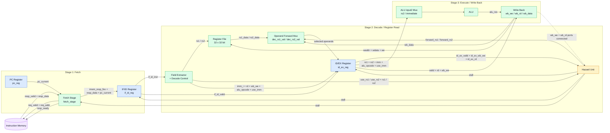

### 色の意味

- 青: 状態を保持する順序回路
- 緑: 組み合わせデータパス
- 黄: 制御ロジック
- 紫: CPU外部インターフェース

---

## 3. Fetch / PC / Instruction Memory

Fetch周辺はrequest、response、PC更新が相互に接続されるため、1枚の図には詰め込まず3つの経路に分ける。

### 3.1 Instruction request path

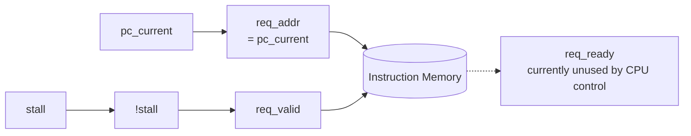

現在、CPUは `stall = 0` の間 `req_valid = 1` とし、`pc_current` を要求アドレスとして出力する。

`req_ready` はinterfaceには存在するが、現在のCPU制御では使用していない。

### 3.2 Instruction response path

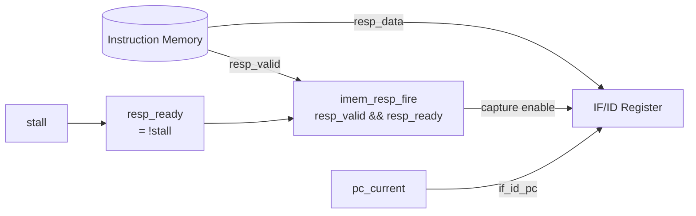

`resp_ready` はCPUからInstruction Memoryへ出力される信号で、現在は `!stall`。

responseを実際に受理したことを表す条件は次の通り。

```text
imem_resp_fire = resp_valid && resp_ready
```

`imem_resp_fire = 1` のとき、`resp_data` とその時点の `pc_current` をIF/IDへ取り込む。

### 3.3 PC update path

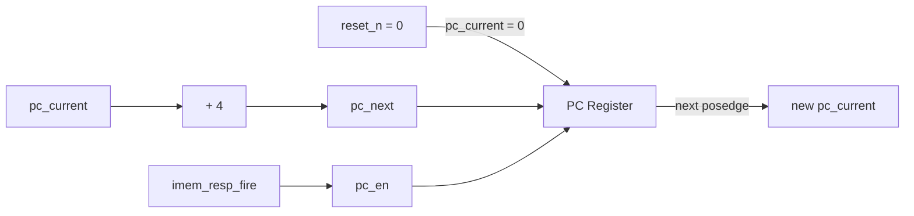

PC Registerは `pc_next` が存在するだけでは更新されない。`pc_en = 1` のクロック立ち上がりでだけ更新する。

### PC更新条件

```text
reset_n = 0:
    pc_current <- 0

posedge clk && reset_n = 1 && pc_en = 1:
    pc_current <- pc_next

pc_next = pc_current + 4
pc_en   = imem_resp_fire
```

したがって現在の設計では、**Instruction Memoryからresponseを受理したときだけPCが4 byte進む**。

### Instruction Memory信号

| Signal | Direction from CPU | Current behavior |
|---|---|---|
| `req_valid` | output | `!stall` |
| `req_addr` | output | `pc_current` |
| `req_ready` | input | interfaceには存在するが、現在CPU制御では未使用 |
| `resp_valid` | input | `imem_resp_fire`生成に使用 |
| `resp_data` | input | IF/IDへ格納 |
| `resp_ready` | output | `!stall` |

---

## 4. IF/ID Register

IF/IDは状態遷移図として考えるより、`always_ff` 内の**更新優先順位**として読む方が現在のRTLに近い。

内部条件:

```text
consume = if_id_valid && !stall
```

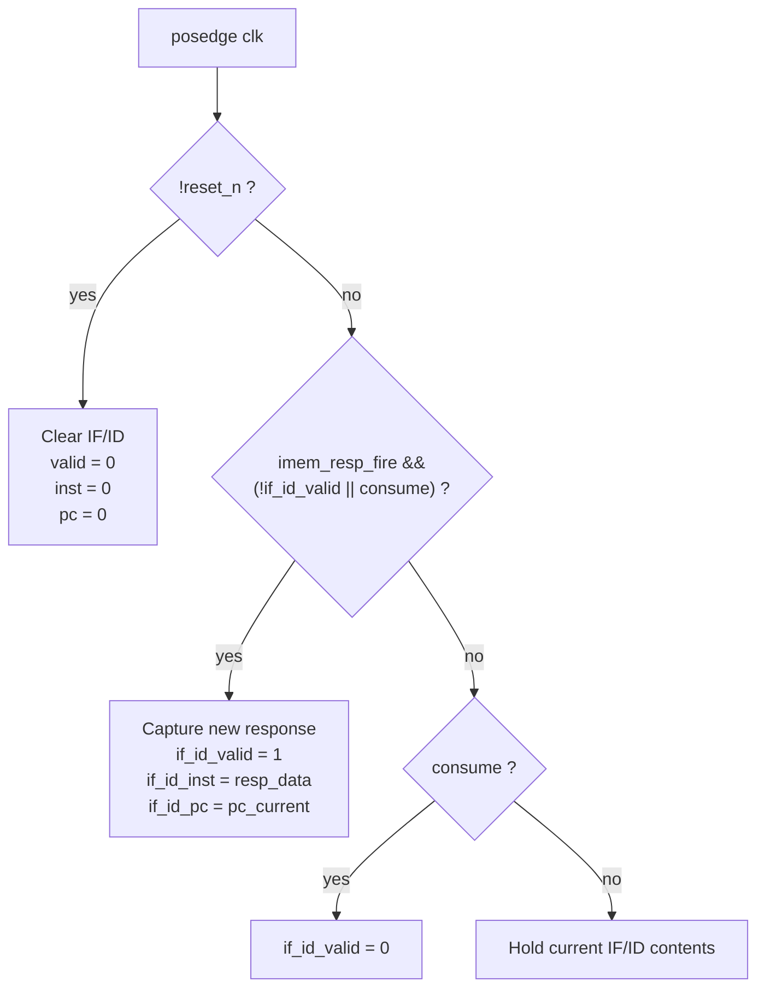

### IF/ID action summary

| Condition | Action |
|---|---|
| `!reset_n` | `valid / inst / pc` を0へclear |
| `stall = 1` | 既存のIF/ID内容をhold |
| response受理可能かつ `imem_resp_fire = 1` | 新しい `resp_data` と `pc_current` をcapture |
| `consume = 1` かつ新responseなし | `if_id_valid = 0` |
| 上記のどれにも該当しない | 現在値をhold |

更新規則:

```text
reset:
    if_id_valid = 0
    if_id_inst  = 0
    if_id_pc    = 0

if imem_resp_fire && (!if_id_valid || consume):
    if_id_valid = 1
    if_id_inst  = imem.resp_data
    if_id_pc    = pc_current

else if consume:
    if_id_valid = 0
```

重要なのは、`stall = 1` では `consume = 0` になるため、既存のIF/ID内容を保持すること。

---

## 5. Decode / Register Read

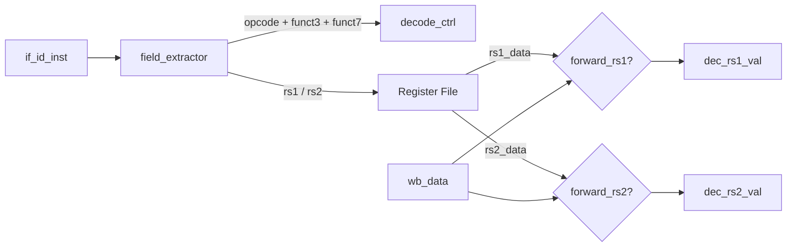

Forward mux:

```text
dec_rs1_val = forward_rs1 ? wb_data : rs1_data
dec_rs2_val = forward_rs2 ? wb_data : rs2_data
```

### Decode outputs captured by ID/EX

```text
rs1_data
rs2_data
imm_i
rd
wb_we
alu_opcode
use_imm
```

### Current supported decode

#### R-Type `0110011`

| Operation | `alu_opcode` |
|---|---:|
| ADD  | `0000` |
| SUB  | `0001` |
| AND  | `0010` |
| OR   | `0011` |
| XOR  | `0100` |
| SLL  | `0101` |
| SRL  | `0110` |
| SRA  | `0111` |
| SLT  | `1000` |
| SLTU | `1001` |

For valid R-Type ALU operations:

```text
use_rs1 = 1
use_rs2 = 1
wb_we   = 1
use_imm = 0
```

#### I-Type `0010011`

現在decodeされるI-Type演算は `funct3 = 000` のADDIのみ。

```text
use_rs1 = 1
use_rs2 = 0
use_imm = 1
wb_we   = 1
alu_opcode = 0000
```

---

## 6. Hazard / Stall / Forwarding

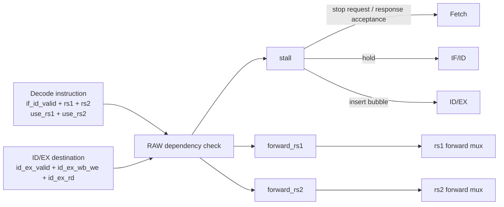

RAW条件の中心は次の比較。

```text
id_ex_valid
&& id_ex_wb_we
&& id_ex_rd != x0
&& (
     (use_rs1 && id_ex_rd == rs1)
     ||
     (use_rs2 && id_ex_rd == rs2)
   )
```

現在のRTLではこのID/EX RAW条件が `stall` を発生させる。

`forward_rs1` / `forward_rs2` も同じID/EX依存を基準に生成し、operand muxでは `wb_data` を選択する。

---

## 7. ID/EX Register

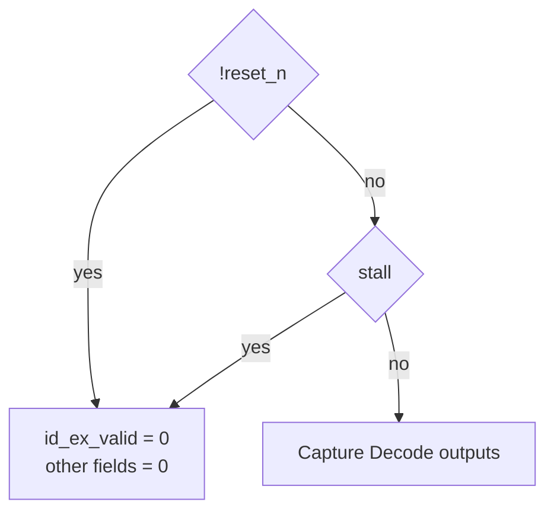

通常時:

```text
id_ex_valid      <- if_id_valid
id_ex_rs1_data   <- dec_rs1_val
id_ex_rs2_data   <- dec_rs2_val
id_ex_imm_i      <- imm_i
id_ex_rd         <- rd
id_ex_wb_we      <- dec_wb_we
id_ex_alu_opcode <- alu_opcode
id_ex_use_imm    <- use_imm
```

`stall = 1` の場合は **ID/EXを保持するのではなくbubbleを挿入する**。

---

## 8. Execute / Write Back

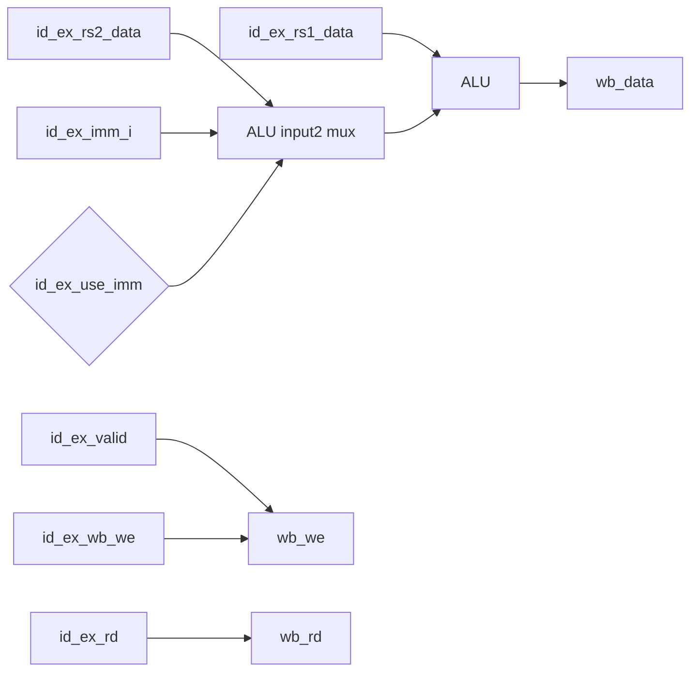

```text
ex_alu_in2 = id_ex_use_imm ? id_ex_imm_i : id_ex_rs2_data

wb_we   = id_ex_valid && id_ex_wb_we
wb_rd   = id_ex_rd
wb_data = alu_res
```

ALU resultは追加のEX/WBパイプラインレジスタを通さず、そのままRegister File書き戻し経路へ接続される。

---

## 9. Register File

- 32 registers
- each register: 32 bit
- `x0` read: always `0`
- `x0` write: ignored
- read ports: combinational
- write port: `posedge clk`

```text
read1 = raddr1 != 0 ? regs[raddr1] : 0
read2 = raddr2 != 0 ? regs[raddr2] : 0

posedge clk:
    if wb_we && wb_rd != 0:
        regs[wb_rd] <- wb_data
```

---

## 10. Pipeline Summary

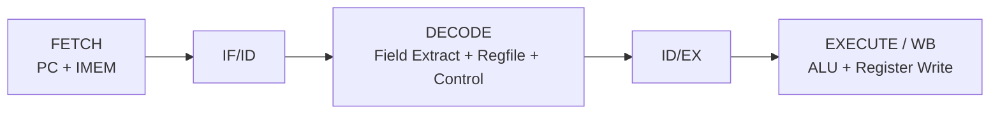

### Stage boundaries

| Stage | Main work | State boundary after stage |
|---|---|---|
| Fetch | PC, instruction-memory request/response | IF/ID |
| Decode | field extraction, control decode, register read, hazard/forward selection | ID/EX |
| Execute / WB | operand2 selection, ALU, register writeback | Register File |

---

## 11. Current Design Invariants

この条件を変更するときは、先にこの文書を変更する。

1. `pc_current` は32 bit。
2. 現在の命令幅は32 bitで、通常のnext PCは `pc_current + 4`。
3. PCは `imem_resp_fire` が成立した場合のみ更新する。
4. `stall = 1` の間、Fetchはrequestを出さずresponseも受理しない。
5. `stall = 1` の間、IF/IDは保持する。
6. `stall = 1` の場合、ID/EXにはbubbleを入れる。
7. Register Fileの `x0` は常に0として扱う。
8. Write Backは `id_ex_valid && id_ex_wb_we` の場合のみ有効。
9. Branch / Jump / Load / Store / Data Memoryは現時点の正本には存在しない。

---

## 12. Current RTL Notes / 要確認事項

ここは「設計として確定した理想形」ではなく、**現在のRTLに存在する事実のうち、今後整理する可能性がある箇所**。

### 12.1 `req_ready` is currently unused

`imem_if`には `req_ready` が存在するが、現在のCPUはPC更新やrequest発行条件に `req_ready` を使用していない。

したがって現在のPC進行条件はrequest handshakeではなく、response側の:

```text
resp_valid && resp_ready
```

のみ。

### 12.2 Forwarding and Stall currently detect the same ID/EX RAW dependency

現在、ID/EXとのRAW dependencyに対して `forward_rs1/2` が生成される一方、同じdependencyで `stall` も立つ。

そのためforwardingを「stallを不要にする経路」として扱うかどうかは、今後の設計判断事項。

### 12.3 Hazard Unit WB inputs

`hazard_unit`には `wb_we` と `wb_rd` が接続されているが、現在の内部ロジックでは使用されていない。

### 12.4 PC value after Decode

`if_id_pc` はIF/IDに保存されるが、現在ID/EXにはPCを保存していない。
`id_ex_pc` 相当のコードはコメントアウトされている。

### 12.5 ALU zero flag

ALUは `zero` を生成するが、現在はBranch等が未実装のため外部制御には使用されていない。

---

## 13. RTL Mapping

| Design block | RTL |
|---|---|
| Top-level wiring | `top.sv` |
| PC Register / Fetch | `rtl/stages/fetch.sv` |
| IF/ID + ID/EX | `rtl/pipeline_regs.sv` |
| Field Extractor / Decode Control | `rtl/stages/dec.sv` |
| Hazard / Forward Control | `rtl/hazard.sv` |
| Register File | `rtl/regfile.sv` |
| Execute / Write Back | `rtl/stages/execute.sv` |
| ALU | `rtl/alu.sv` |
| Instruction Memory Interface | `rtl/imem.sv` |

---

## 14. Design-first Update Rule

機能追加時は次の順序を基本とする。

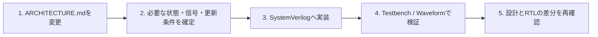

新しい `assign` や `always_ff` を追加する前に、最低でも次を決める。

- その信号は何を意味するか
- combinationalかstateか
- 誰がdriveするか
- 誰がconsumeするか
- 何bitか
- どの条件で有効か
- stall時にhold / clear / bubbleのどれを行うか
- reset時の値

コードから設計を逆算しない。設計からコードへ落とす。
