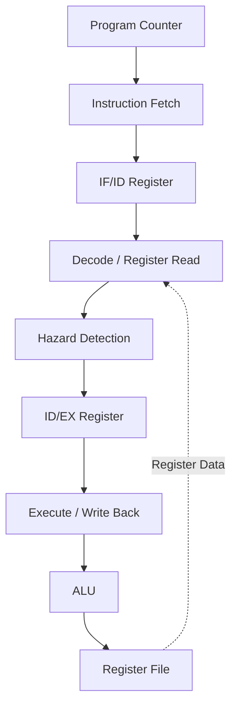
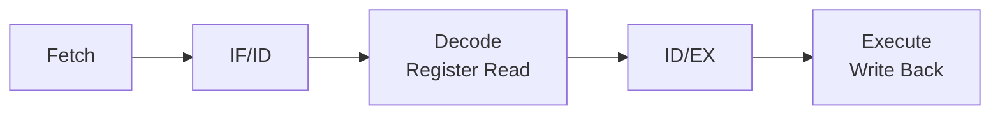
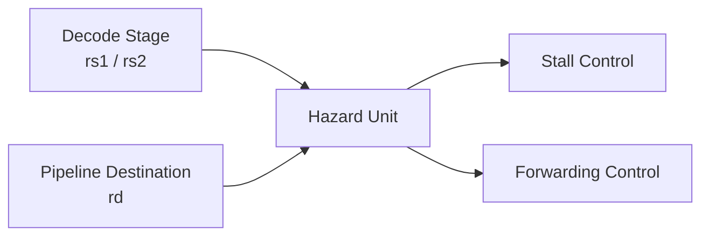
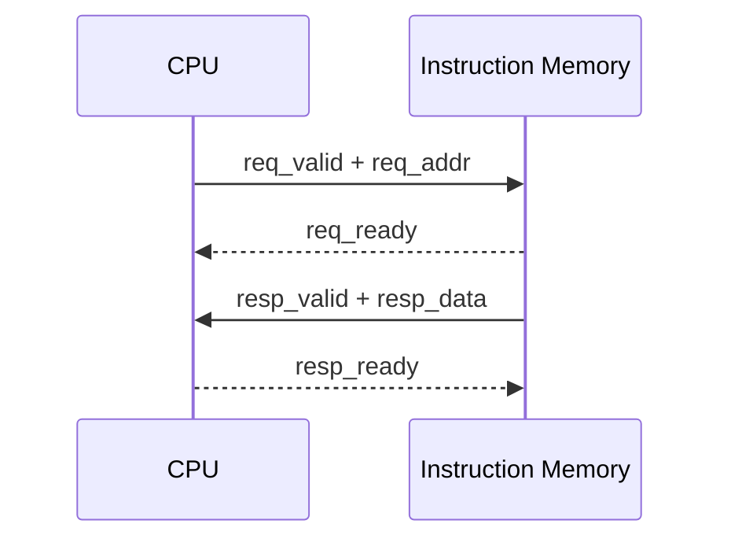

# RV32I 3-Stage Pipelined CPU

SystemVerilogで実装している、RISC-V RV32Iをベースとした32bit CPUです。

コンピュータアーキテクチャとRTL設計への理解を深めることを目的として、命令フェッチ、デコード、実行、レジスタ書き戻しまでを構成し、3段のパイプラインとして実装しています。

現在はRV32Iの一部命令に対応しており、Verilator / Icarus Verilogを用いてシミュレーションと動作確認を行っています。

## アーキテクチャ



現在は以下の3段で構成しています。

1. Fetch
2. Decode / Register Read
3. Execute / Write Back

FetchとDecodeの間にIF/IDレジスタ、DecodeとExecuteの間にID/EXレジスタを配置しています。

## 実装済み機能

現在、以下の機能を実装しています。

- 32bit Program Counter
- 32 × 32bit Register File
- 3-stage pipeline
- RV32I形式の命令フィールド抽出
- Instruction Decoder
- Immediate生成
- ALU
- Data Hazard Detection
- Pipeline Stall
- Forwarding制御
- Valid / Ready形式のInstruction Memory Interface
- SystemVerilog Testbench
- Verilator / Icarus Verilogによるシミュレーション
- GTKWaveによる波形確認

## 実装済み命令

現在はRV32Iのうち、主に算術・論理演算命令を実装しています。

### R-Type

| Instruction | Description  |
| ----------- | ------------ |
| ADD         | 加算         |
| SUB         | 減算         |
| AND         | ビットAND    |
| OR          | ビットOR     |
| XOR         | ビットXOR    |
| SLL         | 論理左シフト |
| SRL         | 論理右シフト |
| SRA         | 算術右シフト |
| SLT         | 符号付き比較 |
| SLTU        | 符号なし比較 |

### I-Type

| Instruction | Description |
| ----------- | ----------- |
| ADDI        | 即値加算    |

RV32Iの全命令にはまだ対応していません。

Branch / Jump、Load / Storeなどは今後実装する予定です。

## パイプライン



パイプラインレジスタには`valid`信号を持たせ、各ステージのデータが有効かどうかを管理しています。

データ依存によって処理を進められない場合は、Hazard Unitからの制御によってパイプラインをstallさせます。

## ハザードハンドリング

パイプライン化によって発生するRAW（Read After Write）データハザードを検出するため、専用のHazard Unitを実装しています。

例えば以下のように、直前の命令が書き込むレジスタを次の命令が参照する場合があります。

```text
ADDI x1, x0, 5
ADD  x3, x1, x2
         ^^
```

この場合、`ADD`が`x1`を読み出す時点で、先行する`ADDI`の結果がまだレジスタファイルへ書き戻されていない可能性があります。

Hazard Unitでは以下を比較して依存関係を検出します。

- Source Register (`rs1`, `rs2`)
- Destination Register (`rd`)
- Register Write Enable
- Pipeline Valid



依存関係に応じてstallやforwardingのための制御信号を生成します。

## Instruction Memory Interface

Instruction Memoryとの接続には、request / response形式のSystemVerilog Interfaceを使用しています。

### Request

```text
req_valid
req_ready
req_addr
```

### Response

```text
resp_valid
resp_ready
resp_data
```



固定レイテンシのメモリに依存せず、requestとresponseをValid / Ready形式で制御できる構成にしています。

## ALU

ALUでは現在以下の演算に対応しています。

```text
ADD
SUB
AND
OR
XOR
SLL
SRL
SRA
SLT
SLTU
```

符号付き比較や算術右シフトでは、SystemVerilogの`signed`演算を使用しています。

## 検証

`tb_cpu_top.sv`にSystemVerilogのテストベンチを実装しています。

テストベンチ上でRISC-V命令を生成し、Instruction Memoryを模したROMからCPUへ命令を供給しています。

例えば以下のプログラムを実行します。

```asm
addi x1, x0, 5
addi x2, x0, 7
add  x3, x1, x2
```

実行後に`x3`の値を確認し、

```text
x3 = 12
```

となることを検証します。

期待値と実行結果が異なる場合には`$fatal`を使用してテストを失敗させます。

現在、以下の演算についてテストを実装しています。

- ADD
- SUB
- XOR
- SLL
- SRL
- SRA
- SLT
- SLTU

## ディレクトリ構造

```text
.
├── README.md
├── top.sv
├── tb_cpu_top.sv
│
└── rtl
    ├── alu.sv
    ├── hazard.sv
    ├── imem.sv
    ├── pipeline_regs.sv
    ├── regfile.sv
    │
    └── stages
        ├── fetch.sv
        ├── dec.sv
        └── execute.sv
```

### Main Modules

| File                    | Role                         |
| ----------------------- | ---------------------------- |
| `top.sv`                | CPU全体の接続                |
| `rtl/alu.sv`            | ALU                          |
| `rtl/regfile.sv`        | Register File                |
| `rtl/hazard.sv`         | Data Hazard Detection        |
| `rtl/pipeline_regs.sv`  | Pipeline Register            |
| `rtl/imem.sv`           | Instruction Memory Interface |
| `rtl/stages/fetch.sv`   | Fetch Stage                  |
| `rtl/stages/dec.sv`     | Decode / Control             |
| `rtl/stages/execute.sv` | Execute / Write Back         |
| `tb_cpu_top.sv`         | Testbench                    |

## シミュレーション

### Verilator

MSYS2 MinGW64環境を使用する場合:

```bash
pacman -Syu
pacman -S --needed \
  mingw-w64-x86_64-verilator \
  mingw-w64-x86_64-gcc \
  mingw-w64-x86_64-make
```

### Build

```bash
verilator -Wall -Wno-fatal \
  --sv \
  --timing \
  --trace \
  --binary \
  --top-module tb_cpu_top \
  rtl/imem.sv \
  rtl/alu.sv \
  rtl/regfile.sv \
  rtl/hazard.sv \
  rtl/pipeline_regs.sv \
  rtl/stages/fetch.sv \
  rtl/stages/dec.sv \
  rtl/stages/execute.sv \
  top.sv \
  tb_cpu_top.sv
```

### Run

```bash
./obj_dir/Vtb_cpu_top
```

## Icarus Verilog

```bash
iverilog -g2012 \
  -o sim.out \
  rtl/imem.sv \
  rtl/alu.sv \
  rtl/regfile.sv \
  rtl/hazard.sv \
  rtl/pipeline_regs.sv \
  rtl/stages/fetch.sv \
  rtl/stages/dec.sv \
  rtl/stages/execute.sv \
  top.sv \
  tb_cpu_top.sv
```

実行:

```bash
vvp sim.out
```

## Waveform

テストベンチからVCD形式の波形を出力できます。

```bash
gtkwave cpu.vcd
```

## ロードマップ

- [x] Program Counter
- [x] Instruction Fetch
- [x] Register File
- [x] Instruction Decode
- [x] ALU
- [x] 3-stage Pipeline
- [x] IF/ID Pipeline Register
- [x] ID/EX Pipeline Register
- [x] Data Hazard Detection
- [x] Pipeline Stall
- [x] Forwarding制御
- [x] SystemVerilog Testbench
- [x] VerilatorによるSimulation
- [ ] RV32I命令セットの拡充
- [ ] Immediate系命令の追加
- [ ] Branch
- [ ] JAL / JALR
- [ ] Load / Store
- [ ] Data Memory
- [ ] Byte Enable
- [ ] MMIO
- [ ] Exception
- [ ] Interrupt
- [ ] Timer
- [ ] Cache
- [ ] FPGA上での動作確認

## プロジェクトの目的

書籍などで学習したコンピュータアーキテクチャを、知識だけで終わらせず、RTLとして実際に設計・検証することを目的として開発しています。

特に、

- パイプライン内部でのデータの流れ
- クロック単位での状態遷移
- データハザード
- Stall
- Forwarding
- Register File
- Instruction Decode
- Valid / Readyによるハンドシェイク

といった、CPUやデジタル回路の内部動作を実装を通して理解することを重視しています。

最終的にはRV32I命令の対応範囲を広げ、Load / Store、MMIO、割り込みなどを追加した上で、FPGA上で実際に動作させることを目標としています。
